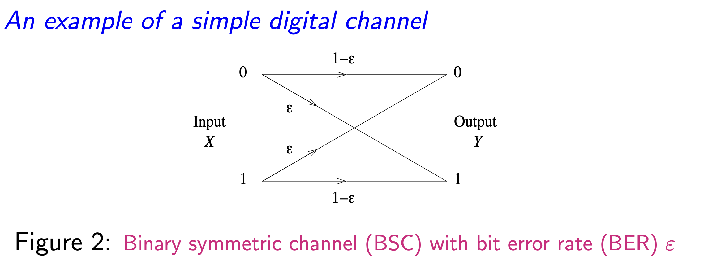
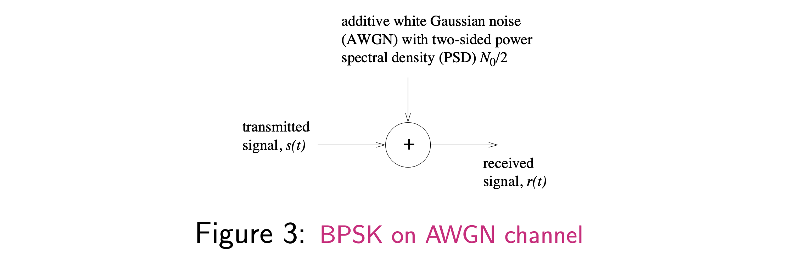
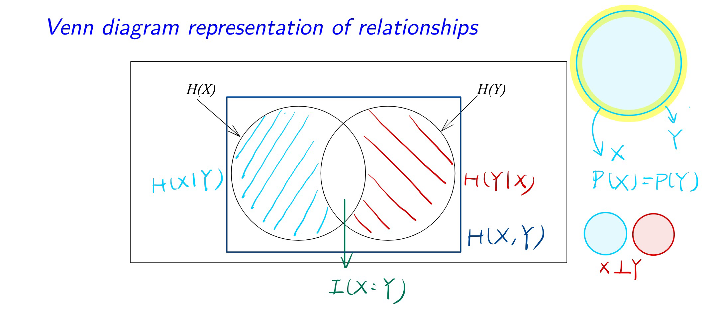
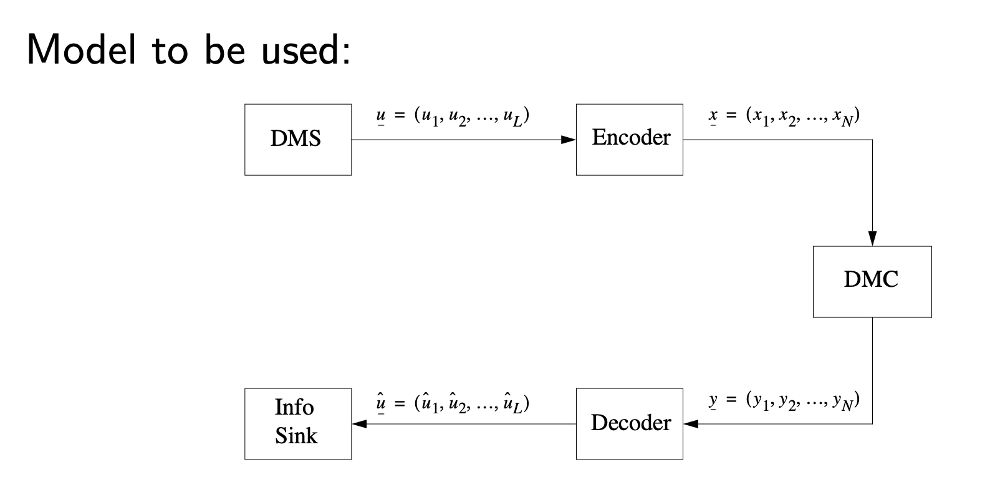

# EECE 566 Part1 Concept Summary

## Source And Channel Concepts

#### DMS
DMS: Discrete Memoryless Source
#### BSS $\in$ DMS
BSS: Binary Symmetric Source
#### DMC
DMC: Discrete Memoryless Channel
#### BSC
BSC: Binary Symmetric Channel
#### BEC
BEC: Binary Erasure Channel
#### BER
BER: Bit Error Rate

#### BPSK
BPSK: Binary Phase Shift Keying -- a special case of binary antipodal signaling
#### AWGN(channel)
AWGN: Additive White Gaussian Noise

#### AGN(channel)
AGN: Additive Gaussian Noise
#### Coding Gain
Coding Gain: The difference between the Energy required to achieve a given BER with coding and the Energy required to achieve the same BER without coding.
#### Hamming Distance
Hamming Distance: The number of bit positions in which two code words differ.
#### Channel Capacity
Channel Capacity: The maximum rate at which information can be transmitted over a given communication channel in the presence of noise.
$$
    C = \max_{p(x)} I(X;Y) = \max_{p(x)} H(Y) - H(Y|X) = \max_{p(x)} H(X) - H(X|Y)\\
$$

## Probability

#### Gussian pdf:

$$
    f(x)=\frac{1}{\sqrt{2\pi}\sigma}e^{-\frac{(x-\mu)^2}{2\sigma^2}}\\
$$

#### Gussian cdf:

$$
    F(x)=\frac{1}{\sqrt{2\pi}\sigma}\int_{-\infty}^{x}e^{-\frac{(x-\mu)^2}{2\sigma^2}}dx\\
$$

#### Gussian Generating Function:
$$
    \phi(s)=E[e^{sX}]=e^{\mu s+\frac{1}{2}\sigma^2s^2}\\
$$

#### $Q(\alpha)$ 
Q function is the tail probability of the standard normal distribution. It is defined as:
$$
    Q(\alpha)=\frac{1}{\sqrt{2\pi}}\int_{\alpha}^{\infty}e^{-\frac{x^2}{2}}dx\\
$$

## Measure of Information
#### Self Entropy

$$
    \mathrm {H} (X)=-\sum _{x\in {\mathcal {X}}}\,p(x)\,\log \,p(x)\\
$$

##### Binary Entropy Function
$$
\mathrm {H} (X)=-\sum _{x\in {\mathcal {X}}}\,p(x)\,\log\,p(x)\\
$$

#### Joint Entropy

$$
    \mathrm {H} (X,Y)=-\sum _{x\in {\mathcal {X}},y\in {\mathcal {Y}}}\,p(x,y)\,\log \,p(x,y)\\
$$
##### Properties

$$
    \mathrm {H} (X,Y)\leq \mathrm {H} (X)+\mathrm {H} (Y) \, iff \, X \, and \, Y \, are \, independent\\
$$

#### Conditional Entropy

$$
    \mathrm {H} (Y|X)=-\sum _{x\in {\mathcal {X}},y\in {\mathcal {Y}}}\,p(x,y)\,\log \,p(y|x)\\
$$
##### Properties

$$
    \mathrm {H} (Y|X)\leq \mathrm {H} (Y)\\
$$

$$
\mathrm {H} (Y|X) = \sum _{x\in {\mathcal {X}}}\,p(x)\,\mathrm {H} (Y|X=x)
$$

#### Relative Entropy
(KL Divergence)

$$
    \mathrm {D} _{\mathrm {KL} }(P\parallel Q)=\sum _{x\in {\mathcal {X}}}\,p(x)\,\log {\frac {p(x)}{q(x)}}\\
$$
##### Properties
positive semi-definite:

$$
    \mathrm {D} _{\mathrm {KL} }(P\parallel Q)\geq 0\\ 
$$

#### Mutual Information

$$
\mathrm {I} (X;Y)=\sum _{x\in {\mathcal {X}},y\in {\mathcal {Y}}}\,p(x,y)\,\log {\frac {p(x,y)}{p(x)\,p(y)}}\\
$$

***Relation ship between KL Divergence and Mutual Information:***

$$
    \mathrm {I} (X;Y)=\mathrm {D} _{\mathrm {KL} }(P(X,Y)\parallel P(X)P(Y))\\  
$$

***Conditional Mutual Information***
$$
\mathrm {I} (X;Y|Z)=\mathrm {H} (X|Z)-\mathrm {H} (X|Y,Z)\\
$$

#### $Relationship \,between \,H(X,Y), H(X|Y), and \, H(Y|X)$
***Relation ship between Joint Entropy and Conditional Entropy:***
$$
        \mathrm {H} (X,Y)=\mathrm {H} (X)+\mathrm {H} (Y|X)\\
$$
***Relation ship between Mutual Information and Conditional Entropy:***
$$
        \mathrm {I} (X;Y)=\mathrm {H} (X)-\mathrm {H} (X|Y)\\
$$
***Relation ship between Mutual Information and Joint Entropy:***
$$
        \mathrm{H}(X) - \mathrm{I}(X;Y) = \mathrm{H} (X|Y) = \mathrm{H} (X,Y) - \mathrm{H} (Y)\\
$$
$$
\mathrm {I} (X;Y)=\mathrm {H} (X)+\mathrm {H} (Y)-\mathrm {H} (X,Y)\\
$$

## Source Coding

#### Uniquely decodable(U.D.)
Uniquely decodable(U.D.): A code is uniquely decodable if different source sequences are mapped into different cw sequences.
#### Prefix-free/Prefix
Instantaneous code/Prefix-free: A code is prefix-free if no cw is a prefix of any other cw.
#### Theorem Kraft Inequality
For prefix-free codes, the following inequality must be satisfied:
D: The number of symbols in the alphabet.

M: The number of codewords.

$n_i$: The length of the i-th codeword.

$$
    \sum_{i=1}^{M}D^{-n_i}\leq 1\\
$$

#### Thereom McMillan Inequality
For uniquely decodable codes, the following inequality must be satisfied:
$$
    \sum_{i=1}^{M}D^{-n_i}\leq 1\\ 
$$

#### Variable-length source coding theorem
##### average codeword length
$$
    \bar{N}=\sum_{i=1}^{M}p_i n_i\\
$$
##### Entropy
$$
    H_D(X)=-\sum_{i=1}^{M}p_i\log_D p_i\\
$$
##### Lower bound

$$
    \bar{N}\geq H_D(X)\\
$$
##### Upper bound

$$
    \bar{N} < H_D(X)+1\\
$$

Choose $n_i = \lceil \log_D \frac{1}{p_i} \rceil$ to minimize $\bar{N}$, then $\bar{N} = H_D(X) + 1$.

#### Huffman Coding
(Optimal variable-length source coding)

Skip its Proof

#### Fixed-length source coding
A sequence of L consecutive symbols from a DMS of alphabet size M
$$
    U_L = \\{ U_1,U_2,...,U_L\\}  
$$
Suppose weuse a code alphabet of size D to encode these sequences into fixed length codewords of length N.

$$
    D^N\geq M^L\\
$$

$$
    \frac{N}{L} \geq \frac{\log M}{\log D}\\
$$

## Universal Source Coding
#### Lempel-Ziv Algorithm
Skip

## Channel Coding

#### DMC
DMC: Discrete Memoryless Channel

#### Shannon's capacity of a DMC

$$
    C = \max_{p(x)} I(X;Y)
$$

##### Calculation

$$
    C = \max_{p(x)} I(X;Y) = \max_{p(x)} H(Y) - H(Y|X) = \max_{p(x)} H(X) - H(X|Y)\\
$$

#### Symmetric DMC
##### Definition
A DMC is symmetric if the output symbols can be  partitioned into subsets in such a way that for each subset each row is a permutation of the other row and each column is a permutation of the other column.
##### Properties
For a symmetric DMC, the capacity is achieved by a uniform input distribution.

#### Channel Capacity Theorem

$p_{e,l} = Pr \\{ \hat{U_l} \not= U_l \\}$

$P_e = \frac{1}{L} \sum_{l=1}^{L} p_{e,l}$
$$
P_elog(M - 1) + h(P_e) \geq H(U) - \frac{\tau_s}{\tau_c}C\\
$$
##### equality holds when
1) $U_l = X_n$, $Y_n = \hat{U_l}$

2) $\hat{U_l}$ and $\mathrm{1}\{U_l \not= \hat{u_l}\}$ are independent

#### Markov Inequality
$$
    Pr \{ X \geq \sigma \} \leq \frac{E[X]}{\sigma}\\
$$

#### Chernoff Bound
$$
    Pr \{ X \geq \sigma \} \leq \frac{E[e^{sX}]}{e^{s\sigma}}, \, s > 0\\
$$

$$
    Pr \{ X \geq \sigma \} \geq \frac{E[e^{sX}]}{e^{s\sigma}}, \, s < 0\\
$$

## Continuous random variables

#### Entropy
$$
    H(X) = -\int_{-\infty}^{\infty}f(x)\log f(x)dx\\
$$
##### Entropy of Gaussian random variable

$$
    H(X) = \frac{1}{2}\log(2\pi e\sigma^2)\\
$$

#### Mutual Information
$$
    I(X;Y) = \int_{-\infty}^{\infty}\int_{-\infty}^{\infty}f(x,y)\log\frac{f(x,y)}{f(x)f(y)}dxdy\\
$$
##### Capacity of Gaussian channel

$$
    C = \frac{1}{2}\log(1+\frac{E}{\sigma^2})\\
$$

#### Capacity of parallel

$$
    C = \sum_{i=1}^{n}C_i = \sum_{i=1}^{n}\frac{1}{2}\log(1+\frac{E_i}{\sigma_i^2})\\
$$

