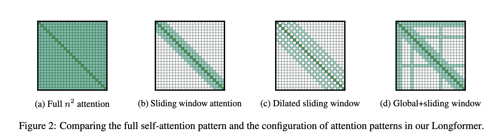
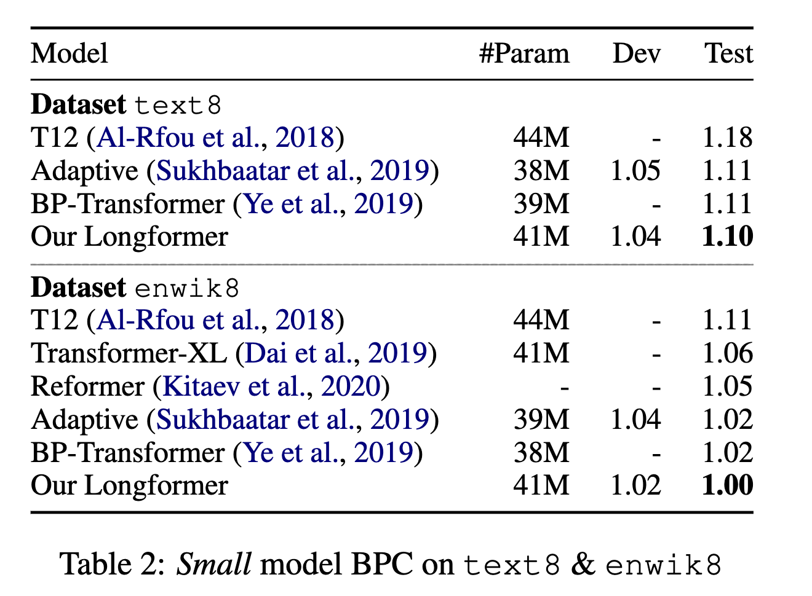
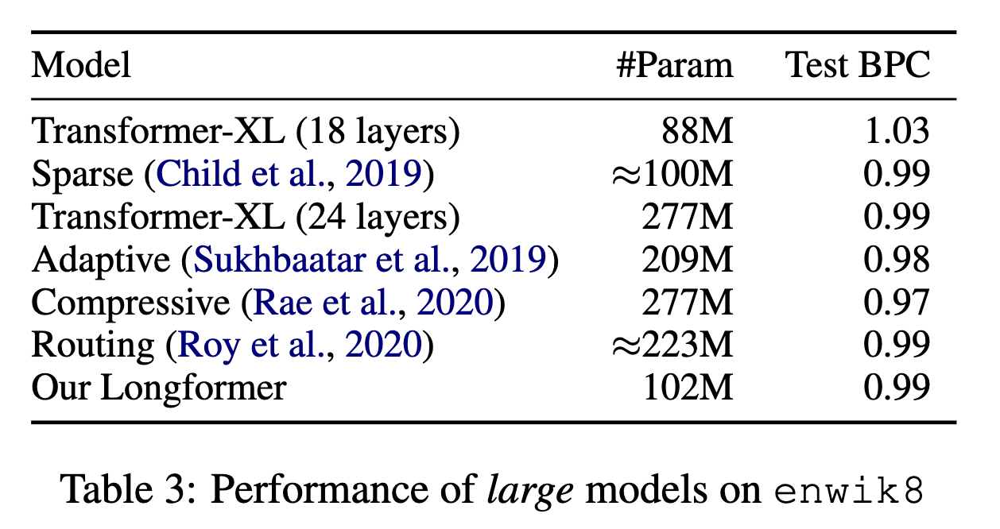

---
categories:
  - Transformer
date: 2024-06-28
draft: false
links:
  - index.md
readtime: 15
slug: Longformer
authors:
  - <qihang>
---
# Longformer: The Long-Document Transformer

## Links:
- [paper](https://arxiv.org/abs/2004.05150)

- [code](https://github.com/allenai/longformer)

  <!-- more -->

## Attention Pattern

### Sliding Window

Our attention pattern employs a ***fixed-size window attention surrounding each token***. ***Using multiple stacked layers*** of such windowed attention results in a large receptive field, where top layers have access to all input locations and have the capacity to build representations that incorporate information across the entire input, **similar to CNNs**.

### Dilated Sliding Window

The sliding window can be "dilated". This is analogous to dilated CNNs where the window has gaps of size dilation $  d  $​.

In multi-headed attention, each attention head computes a different attention score. We found settings **with different dilation configurations per head improves performance by allowing some heads without dilation to focus on local context, while others with dilation focus on longer context.**

### Global Attention

Accordingly, we add "global attention" on a few pre-selected input locations. Importantly, we make this attention operation symmetric: that is, a token with a global attention attends to all tokens across the sequence, and all tokens in the sequence attend to it.

## Performance

To compare to prior work we focus on character-level LM.

