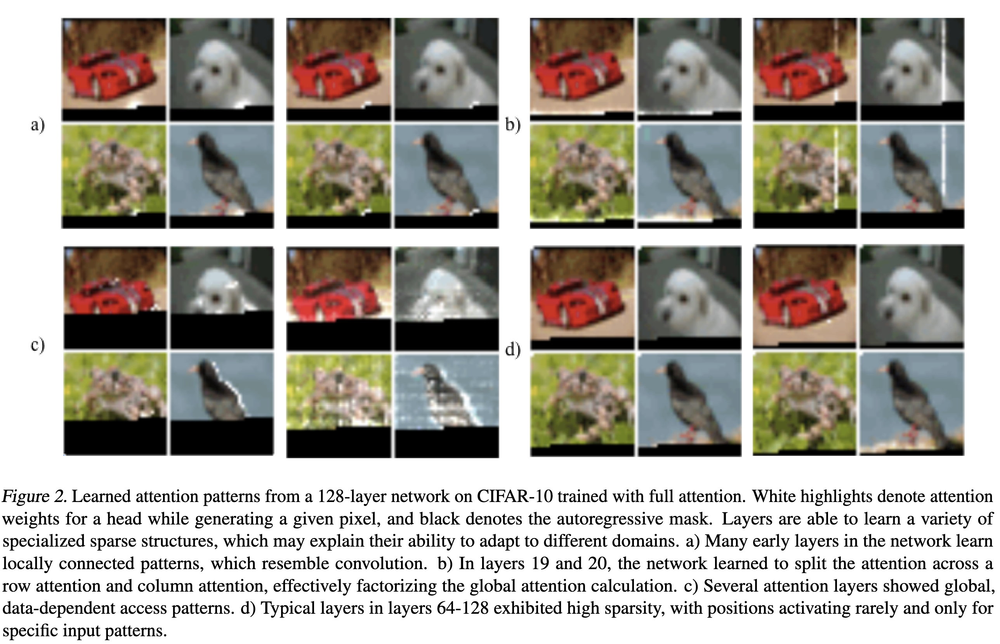
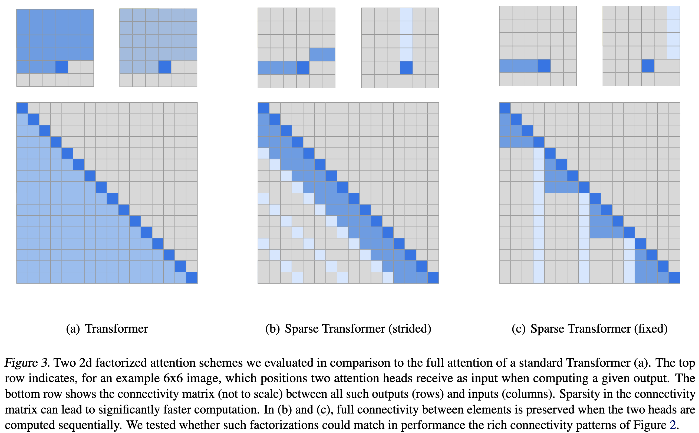
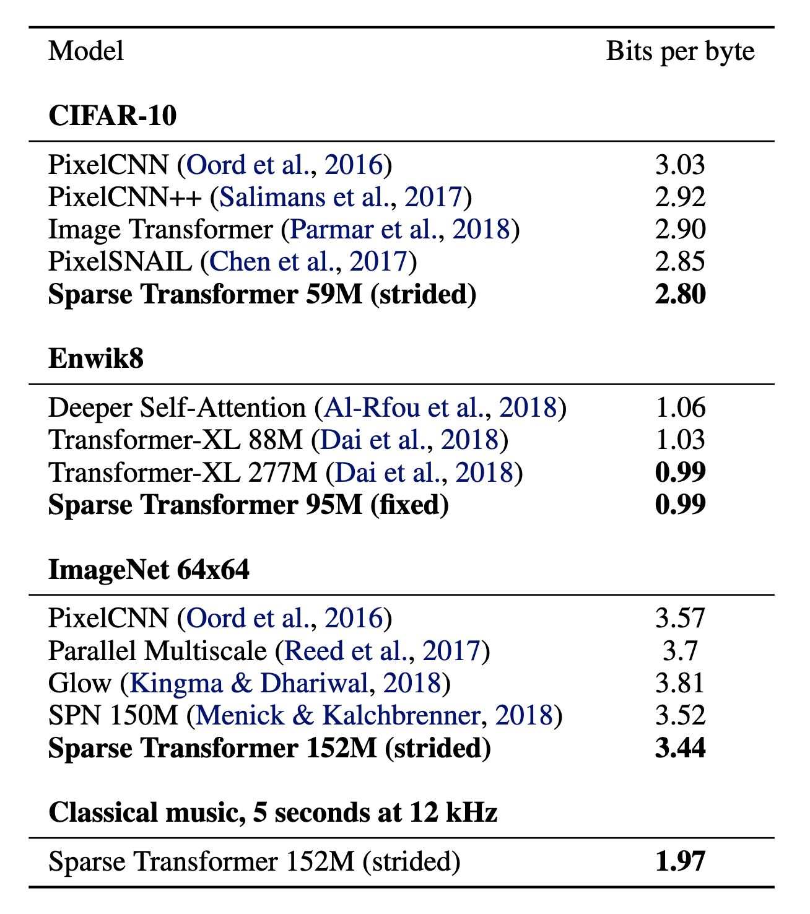
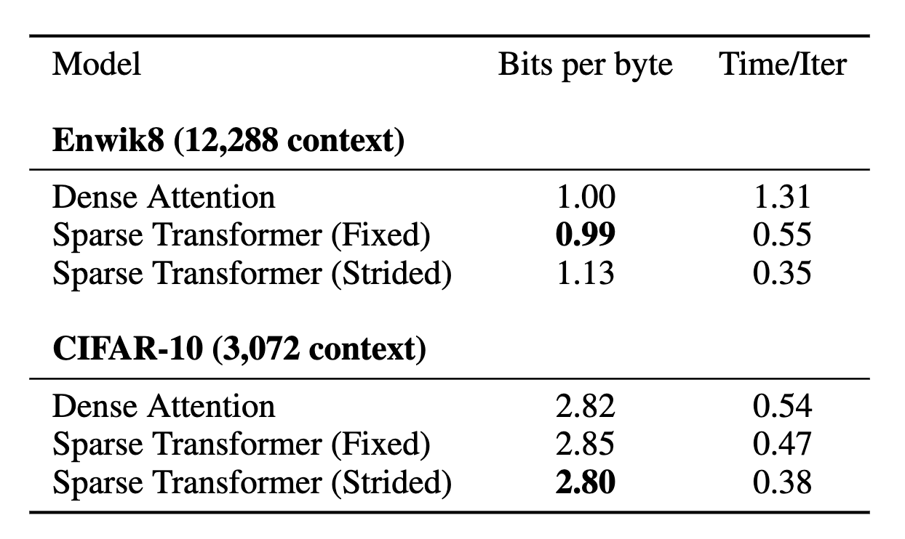
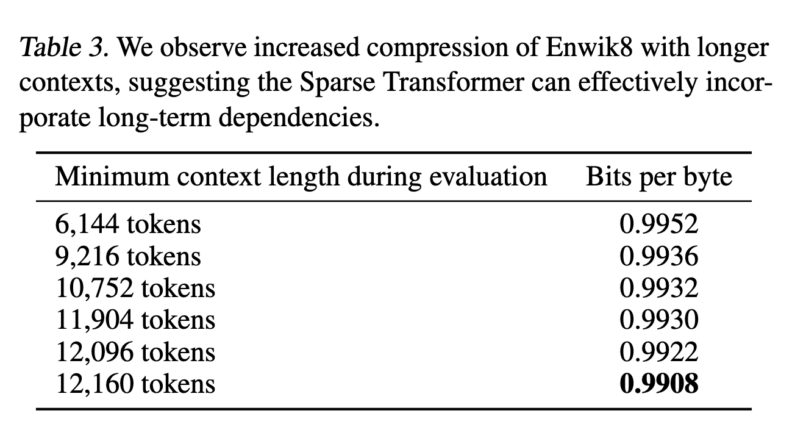
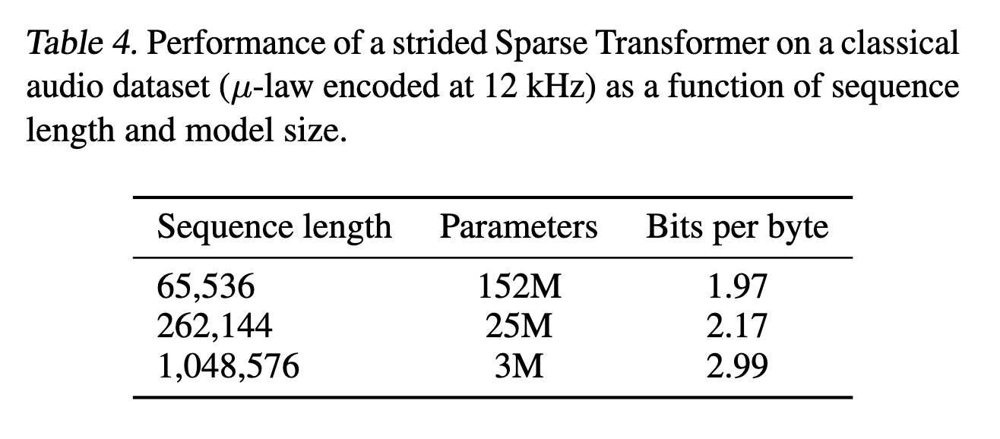

---
categories:
  - Transformer
date: 2024-06-26
draft: false
links:
  - index.md
readtime: 15
slug: sparse-transformer-openai
authors:
  - <qihang>
---
# Generating Long Sequences with Sparse Transformers

## Links:
- [paper](https://arxiv.org/abs/1904.10509)

- [code](https://github.com/openai/sparse_attention)

- [Blog](https://openai.com/index/sparse-transformer/)

  <!-- more -->
## Introduction

This paper introduces sparse factorizations of the attention matrix which **reduce this to $O(n\sqrt{n})$** and following points:

a) **A variation on architecture and initialization to train deeper networks.**

b) **The recomputation of attention matrices to save memory.**

c) **Fast attention kernels for training.**

They call networks with these changes Sparse Transformers, and show they can model sequences tens of thousands of timesteps long using hundreds of layers. It is possible in principle to use self-attention to model sequences of length one million or more.

## Factorized Self-Attention

### Qualitative assessment
A qualitative assessment of attention patterns learned by a standard Transformer on an image dataset:

### Factorized self-attention

A self-attention layer maps a matrix of input embeddings $X$ to an output matrix and is parameterized by a connectivity pattern $S = \{S_1, ..., S_n\}$, where $S_i$ denotes the set of indices of the input vectors to which the $i$th output vector attends. The output vector is a weighted sum of transformations of the input vectors:

$$
\text{Attend}(X, S) = \left( a(\mathbf{x}_i, S_i) \right)_{i \in \{1, ..., n\}} \tag{1}
$$

$$
a(\mathbf{x}_i, S_i) = \text{softmax} \left( \frac{(W_q \mathbf{x}_i) K_{S_i}^T}{\sqrt{d}} \right) V_{S_i} \tag{2}
$$

$$
K_{S_i} = \left( W_k \mathbf{x}_j \right)_{j \in S_i} \quad V_{S_i} = \left( W_v \mathbf{x}_j \right)_{j \in S_i} \tag{3}
$$

Here **$W_q$, $W_k$, and $W_v$ represent the weight matrices which transform a given $\mathbf{x}_i$ into a query, key, or value, and $d$ is the inner dimension of the queries and keys.** The output at each position is a sum of the values weighted by the scaled dot-product similarity of the keys and queries.

**Examples:**

1) **Full self-attention for autoregressive models defines $S_i = \{j : j \le i\}$,** allowing every element to attend to all previous positions and its own position.

2) Factorized self-attention instead **has $p$ separate attention heads**, where **the $m$th head defines a subset of the indices $A_i^{(m)} \subset \{j : j \le i\}$ and lets $S_i = A_i^{(m)}$.** We are chiefly interested in **efficient choices for the subset $A$,** where $|A_i^{(m)}| \propto n^\frac{1}{p}$​​.

**Two criteria:**

1) Additionally, for the time being we consider valid choices of $A$, where ***all input positions are connected to all future output positions across the $p$ steps of attention***.

2) For every $j \le i$ pair, **we set every $A$ such that $i$ can attend to $j$ through a path of locations with maximum length $p + 1$.** Specifically, if $(j, a, b, c, ..., i)$ is the path of indices, then $j \in A_a^{(1)}, a \in A_b^{(2)}, b \in A_c^{(3)}$, and so forth.

These two criteria allow us to keep the ability of Transformers to propagate signals from arbitrary input positions to arbitrary output positions in a constant number of steps, while reducing the total effective computation to $O(n \cdot n^{\frac{1}{p}})$. We also note that softening the validity criterion (for instance, having a series of only locally connected layers) may be a useful inductive bias for certain domains.

In this work, we explore two factorizations for $p = 2$​, which we describe in the following section, though we note that the same techniques can be easily extended to higher dimensions.

### 2D factorized attention

1) **Strided Pattern**

A natural approach to defining a factorized attention pattern in two dimensions is to have one head attend to the previous $l$ locations, and the other head attend to every $l$th location, where $l$ is the stride and chosen to be close to $\sqrt{n}$​, a method we call strided attention.

$A_i^{(1)} = \{t, t + 1, ..., i\}$ for $t = \max(0, i - l)$ 

$A_i^{(2)} = \{j : (i - j) \mod l = 0\}$. 

*Pro:* This formulation is convenient if the data naturally has a structure that aligns with the stride, **like images** or **some types of music**. 

*Cons:* For data without a periodic structure, like text, however, we find that the network can fail to properly route information with the strided pattern, as spatial coordinates for an element do not necessarily correlate with the positions where the element may be most relevant in the future.

2) **Fixed Pattern**

In those cases, we instead use a fixed attention pattern, where **specific cells summarize previous locations and propagate that information to all future cells**.

$A_i^{(1)} = \{j : (\lfloor j/l \rfloor = \lfloor i/l \rfloor)\}$

$A_i^{(2)} = \{j : j \mod l \in \{t, t + 1, ..., l\}\}$,  where $t = l - c$ and $c$ is a hyperparameter.

Concretely, if the stride is 128 and $c = 8$, then all future positions greater than 128 can attend to positions 120-128, all positions greater than 256 can attend to 248-256, and so forth.

A fixed-attention pattern with $c = 1$ limits the expressivity of the network significantly, as many representations in the network is only used for one block whereas a small number of locations are used by all blocks. We instead found choosing \( $c \in \{8, 16, 32\}$ \) for typical values of \($ l \in \{128, 256\}$ \) to perform well, although it should be noted that this increases the computational cost of this method by \( c \) in comparison to the strided attention.

Additionally, we found that when using multiple heads, having them attend to distinct subblocks of length  $c$  within the block of size  $l$ was preferable to having them attend to the same subblock.

In the subsequent section, we describe how to incorporate factorized attention into the Sparse Transformer architecture.

## Performance

