---
categories:
  - Explainability
date: 2024-04-16
draft: false
links:
  - index.md
readtime: 15
slug: Toy-Models-of-Superposition
authors:
  - <qihang>
---
# Toy Models of Superposition

<!-- more -->
## Links:
[Paper](https://transformer-circuits.pub/2022/toy_model/index.html)
[Code](https://github.com/anthropics/toy-models-of-superposition)
[Colab](https://colab.research.google.com/github/anthropics/toy-models-of-superposition/blob/main/toy_models.ipynb)
## [Motivation](https://transformer-circuits.pub/2022/toy_model/index.html#motivation)

***Observation:*** Empirically, in models we have studied, **some of the neurons do cleanly map to features**. But **it isn't always the case that features correspond so cleanly to neurons**, especially in large language models where it actually seems rare for neurons to correspond to clean features.

***superposition***: how and when models represent more features than they have dimensions. 

Consider a toy model:

+ Train an embedding of ***five features*** of varying importance in ***two dimensions***
+ Add a ReLU afterwards for filtering
+ Vary the sparsity of the features

> ***Q: What is sparsity?***
>
> Where “importance” is a scalar multiplier on mean squared error loss.

***Phenomena***: 

1. With dense features, the model learns to represent an orthogonal basis of the most important two features, and the other three features are not represented.
2. If we make the features sparse, this changes:

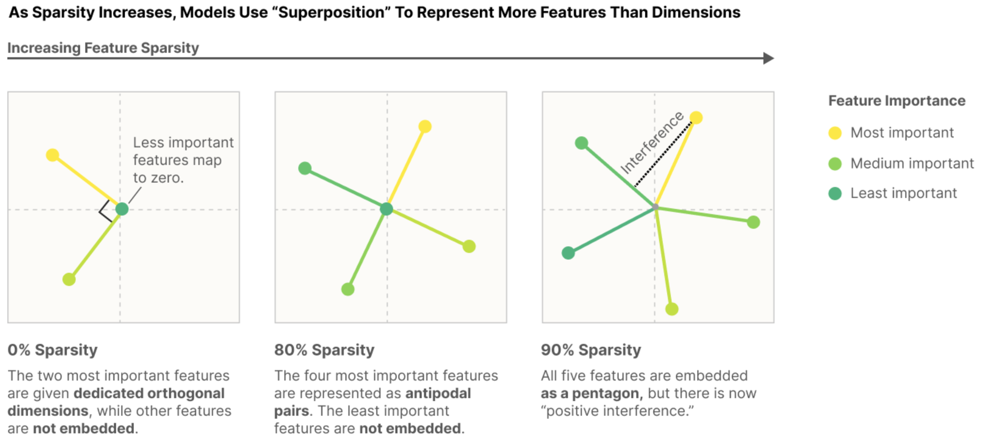

+ Models can store additional features in superposition by tolerating some interference. 
+ In certain limited cases, *models can perform computation while in superposition*.

***Contribution:*** 

We offer a theory of when and why this occurs, revealing a  [phase diagram](https://transformer-circuits.pub/2022/toy_model/index.html#phase-change) for superposition. This [explains](https://transformer-circuits.pub/2022/toy_model/index.html#privileged-basis) why neurons are sometimes "monosemantic" responding to a single feature, and sometimes "polysemantic" responding to many unrelated features.

***[KEY RESULTS FROM TOY MODELS](https://transformer-circuits.pub/2022/toy_model/index.html#key-results)***

- **Superposition is a real, observed phenomenon**.
- **Both monosemantic and polysemantic neurons can form.**
- **At least some kinds of computation can be performed in superposition.**
- **Whether features are stored in superposition is** **governed by a phase change****.** 
- **Superposition organizes features into geometric structures** such as digons, triangles, pentagons, and tetrahedrons.

## [Definitions and Motivation](https://transformer-circuits.pub/2022/toy_model/index.html#motivation)

In our work, we often think of neural networks as having ***features of the input*** represented as *directions* *in activation space*.

> ***Q: What is activation space?***
>
> ***Q: Which one is represented as direction? Feature or input?***


***Linear representation hypothesis***: 

- **Decomposability:** Network representations can be described in terms of independently understandable features.
- **Linearity:** Features are represented by direction.


Sometimes, identifying feature directions is very easy because ***features seem to correspond to neurons.*** Why is it that we sometimes get this extremely helpful property, but in other cases don't? We hypothesize that there are really two countervailing forces driving this:

- **Privileged Basis:** Only some representations have a *privileged basis* which encourages features to align with basis directions (***i.e. to correspond to neurons***).

- **Superposition:** Linear representations can represent more features than dimensions, using a strategy we call *superposition*. This can be seen as neural networks *simulating larger networks*. This pushes features *away* from corresponding to neurons.

  

### ***[Empirical Phenomena](https://transformer-circuits.pub/2022/toy_model/index.html#motivation-empirical)***

- **Word Embeddings** 

  ```
  V("king") - V("man") + V("woman") = V("queen")
  ```

+ **Latent Spaces** - Similar "vector arithmetic" and interpretable direction results have also been found for generative adversarial networks 

+ **Universality**

   Many analogous neurons responding to the same properties can be found across networks

+ **Polysemantic Neurons**

   At the same time, there are also many neurons which appear to not respond to an interpretable property of the input, and in particular, **many polysemantic neurons which appear to respond to unrelated mixtures of inputs**.

### **[What are Features?](https://transformer-circuits.pub/2022/toy_model/index.html#motivation-features)**

Our use of the term "feature" is motivated ***by the interpretable properties of the input we observe neurons (or word embedding directions) responding to***. There's a rich variety of such observed properties! We'd like to use the term "feature" to encompass all these properties.

**Three potential working definitions:**

- **Features as arbitrary functions.** One approach would be to define features **as any function of the input**. But this doesn't quite seem to fit our motivations. There's something special about these features that we're observing: **they seem to in some sense be fundamental abstractions for reasoning about the data, with the same features forming reliably across models**. ***Features also seem identifiable***: cat and car are two features while cat+car and cat-car seem like mixtures of features rather than features in some important sense.

  > ***Q: Are the features functions themselves or the output of function?***

- **Features as interpretable properties.** All the features we described are strikingly understandable to humans. One could try to use this for a definition: ***features are the presence of human understandable "concepts" in the input***. But ***it seems important to allow for features we might not understand***. If AlphaFold discovers some important chemical structure for predicting protein folding, it very well might not be something we initially understand!

- **Neurons in Sufficiently Large Models.** A final approach is to define features as ***properties of the input which a sufficiently large neural network will reliably dedicate a neuron to representing.*** For example, curve detectors appear to reliably occur across sufficiently sophisticated vision models, and so are a feature. For interpretable properties which we presently only observe in polysemantic neurons, the hope is that a sufficiently large model would dedicate a neuron to them. This definition is slightly circular, but avoids the issues with the earlier ones.

### [Features as Directions](https://transformer-circuits.pub/2022/toy_model/index.html#motivation-directions)

Let's call a neural network representation linear **if features correspond to directions in activation space.** In a linear representation, each feature $f_i$ has a corresponding representation direction $\mathbf{W}_{f_i}$. The presence of multiple features $f_1, f_2, \ldots$ activating with values $f_1, f_2, \ldots$ is represented by $\mathbf{x}_{f_1} \mathbf{W}_{f_1} + \mathbf{x}_{f_2} \mathbf{W}_{f_2} + \ldots$. To be clear, **the features being represented are almost certainly nonlinear functions of the input.** **It's only the map from features to activation vectors which is linear**. Note that whether something is a linear representation depends on what you consider to be the features.

> ***Q: what is so called activation vectors?***

 **Three major benefits of linear representations:**

- ***Linear representations are the natural outputs of obvious algorithms a layer might implement.***
- ***Linear representations make features "linearly accessible."*** 
- ***Statistical Efficiency***

### [Privileged vs Non-privileged Bases](https://transformer-circuits.pub/2022/toy_model/index.html#motivation-privileged)

+ When researchers study word embeddings, it doesn't make sense to analyze basis directions. There would be no reason to expect a basis dimension to be different from any other possible direction. This is what we mean by a *non-privileged basis*.
+  Often, something about the architecture makes the basis directions special, ***such as applying an activation function.*** This "breaks the symmetry", making those directions special, and potentially encouraging features to align with the basis dimensions. We call this a *privileged basis*, and ***call the basis directions "neurons."***  **Often, these neurons correspond to interpretable features.**


From this perspective, **it only makes sense to ask if a *neuron* is interpretable when it is in a privileged basis.** ***In fact, we typically reserve the word "neuron" for basis directions which are in a privileged basis.*** 

Note that having a privileged basis doesn't guarantee that features will be basis-aligned – we'll see that they often aren't! But it's a minimal condition for the question to even make sense.

### [The Superposition Hypothesis](https://transformer-circuits.pub/2022/toy_model/index.html#motivation-superposition)

Several results from mathematics suggest that something like this might be plausible:

- **Almost Orthogonal Vectors.** Although it's only possible to have $n$ orthogonal vectors in an $n$-dimensional space, it's possible to **have $\exp(n)$** many "almost orthogonal" (**cosine similarity $< \epsilon$**) vectors in high-dimensional spaces. This concept is related to the Johnson–Lindenstrauss lemma.
- **Compressed Sensing.** In general, if one projects a vector into a lower-dimensional space, one can't reconstruct the original vector. However, this changes if one knows that the original vector is sparse. In this case, it is often possible to recover the original vector.


***Trade-off of superposition***

Since the features are only almost-orthogonal, **one feature activating looks like other features slightly activating.** 

But for neural networks with highly sparse features, this cost may be outweighed by the benefit of being able to represent more features! 


One way to think of this is that a small neural network may be able to noisily "simulate" a sparse larger model:

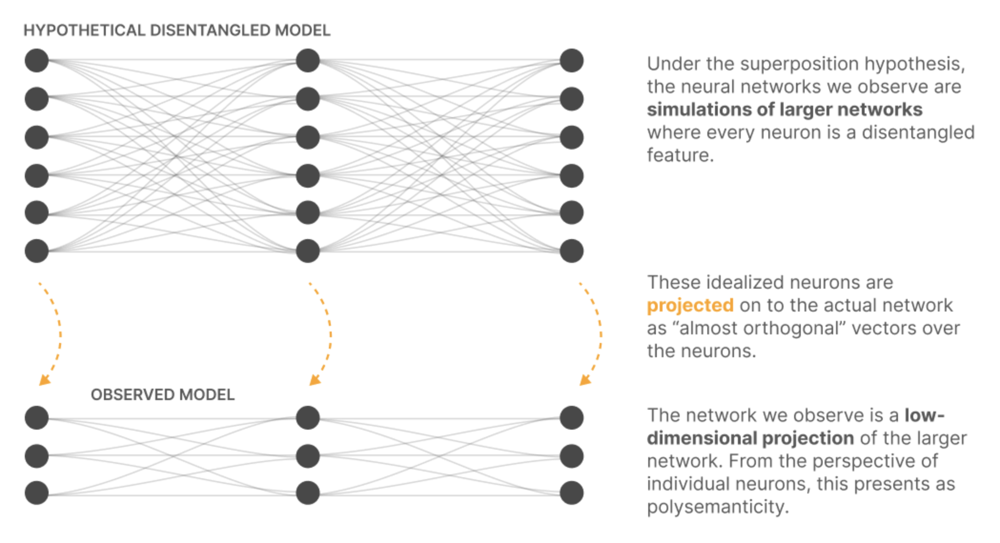

## [Demonstrating Superposition](https://transformer-circuits.pub/2022/toy_model/index.html#demonstrating)

Whether neural networks can actually noisily represent more features than they have neurons?

### [Experiment Setup](https://transformer-circuits.pub/2022/toy_model/index.html#demonstrating-setup)

Our goal is to explore whether a neural network can project **a high-dimensional vector $x \in \mathbb{R}^n$** into **a lower-dimensional vector $h \in \mathbb{R}^m$** and then recover it.

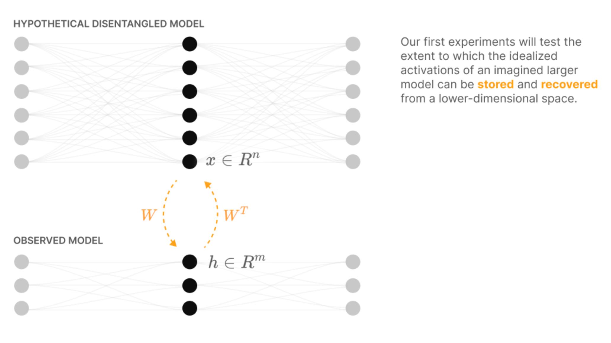

> Really similar to Compressed sensing. Review later.

We begin by describing the high-dimensional vector $x$: the activations of our idealized, disentangled larger model. **We call each element $x_i$ a "feature" because we're imagining features to be perfectly aligned with neurons in the hypothetical larger model.**

**Three major assumptions:**

+ **Feature Sparsity**

+ **More Features Than Neurons**

  > ***Q:There are an enormous number of potentially useful features a model might represent?***

+ **Features Vary in Importance**

**Synthetic data definition:** 

+ Each dimension $x_i$ to be a "feature". Each one has an **associated sparsity $S_i$ and importance $I_i$.** 
+ We let **$x_i = 0$ with probability $S_i$**, but is otherwise uniformly distributed between $[0, 1]$. 
+ In practice, we focus on the case where **all features have the same sparsity, $S_i = S$.**

#### [THE MODEL ($\vec{X} \to \vec{X}'$)](https://transformer-circuits.pub/2022/toy_model/index.html#demonstrating-setup-model)

1. The first "linear model" is a well understood baseline which **does not exhibit superposition**. 
2. The second "ReLU output model" is a **very simple model which does exhibit superposition**. 
3. The two models vary **only in the final activation function**.

| **Linear Model**  | **ReLU Output Model**          |
| ----------------- | ------------------------------ |
| $h = Wx$          | $h = Wx$                       |
| $x' = W^T h + b$  | $x' = \text{ReLU}(W^T h + b)$  |
| $x' = W^T Wx + b$ | $x' = \text{ReLU}(W^T Wx + b)$ |

**The ability to set a negative bias is important** for superposition for a second set of reasons – roughly, it allows models to discard small amounts of noise.

The superposition hypothesis suggests that each feature in the higher-dimensional model corresponds to a direction in the lower-dimensional space. **This means we can represent the down projection as a linear map $h = Wx$. Note that each column $W_i$ corresponds to the direction in the lower-dimensional space that represents a feature $x_i$.**

#### [THE LOSS](https://transformer-circuits.pub/2022/toy_model/index.html#demonstrating-setup-loss)

Weighted mean squared error weighted by the feature importances, $I_i$:

$$
L = \sum_i I_i (x_i - x'_i)^2
$$

### [Basic Results](https://transformer-circuits.pub/2022/toy_model/index.html#demonstrating-basic-results)

+ Train a few ReLU output models with different sparsity levels and visualize the results. 

+ Also train a linear model – if optimized well enough, the linear model solution does not depend on sparsity level.

Visualize **$W^T W$ (a features by features matrix)** and **$\mathbf{b}$ (a feature length vector)**:

Features are arranged from most important to least, so the results have a fairly nice structure. For a small model **($n=20; m=5;$):**

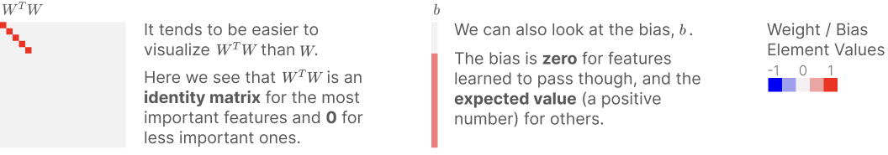

How many features are represented? Whether a given feature shares its dimension with other features?

+ How many features the model learns to represent? For any feature, **whether or not it is represented is determined by $\|W_i\|$**, the norm of its embedding vector.
+ Whether a given feature shares its dimension with other features is determined by calculating $\sum_{j \neq i} ( \hat{W}_i \cdot W_j )^2$, projecting all other features onto the direction vector of $W_i$. **It will be $0$ if the feature is orthogonal to other features (dark blue below). On the other hand, values $\geq 1$ mean that there is some group of other features which can activate $W_i$ as strongly as feature $i$ itself!**

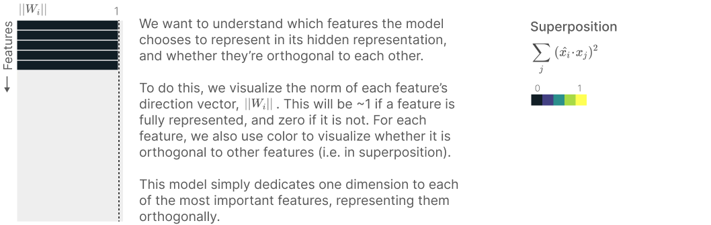

Start by considering models with only a few features **($n=20; m=5; I_i = 0.7$ for each $i$).**

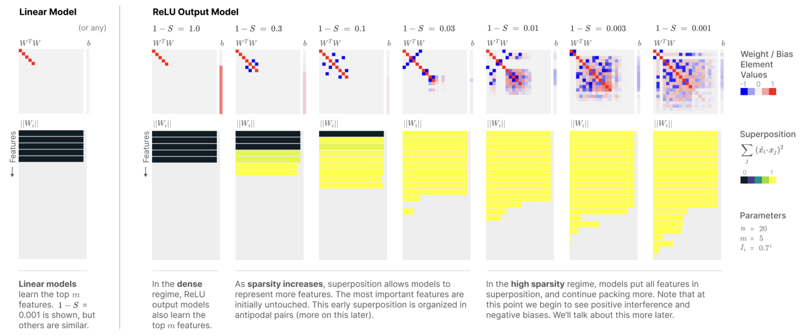

The ReLU output model behaves the same on dense features ($1 - S = 1.0$), but as sparsity increases, we see superposition emerge.

For example, if we consider a model with **$m=20$ hidden dimensions and $n=80$ features** (with importance increased to **$I_i = 0.9$** for each $i$ to account for having more features)

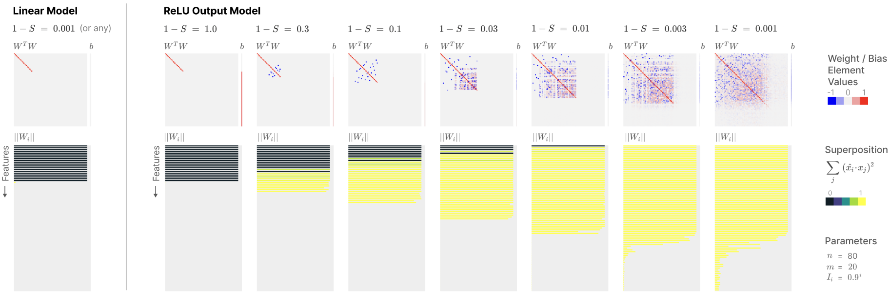

### [Mathematical Understanding](https://transformer-circuits.pub/2022/toy_model/index.html#demonstrating-math)

Neural network weights can be thought of as optimizing a simple closed-form solution:

We can tweak their problem to be a bit more similar to our linear case, revealing the following equation:

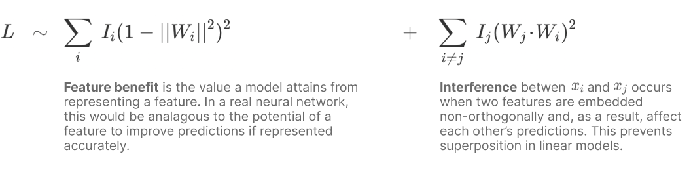

1. Firstly, the model can attain a better loss by representing more features (we've labeled this "feature benefit").
2. But it also gets a worse loss if it represents more than it can fit orthogonally due to "interference" between features.
3. In fact, this makes it never worthwhile for the linear model to represent more features than it has dimensions.

**For the ReLU output model?** 
$$
L = \int_x \| I(x - \text{ReLU}(W^T Wx + b)) \|^2 \, dp(x)
$$

where $x$ is distributed such that **$x_i = 0$ with probability $S$.**

**The integral over $x$ decomposes into a term for each sparsity pattern** according to the binomial expansion of $((1-S) + S)^n$. We can group terms of the sparsity together, rewriting the loss as:
$$
L = (1-S)^n L_n + \ldots + (1-S)S^{n-1} L_1 + S^n L_0,
$$

with **each $L_k$ corresponding to the loss when the input is a $k$-sparse vector**. 

Note that **as $S \to 1$, $L_1$ and $L_0$ dominate**:

1. **The $L_0$ term,** corresponding to the loss on a zero vector, **is just a penalty on positive biases**, $\sum_i \text{ReLU}(b_i)^2$. 
2. So the interesting term is $L_1$, the loss on 1-sparse vectors:

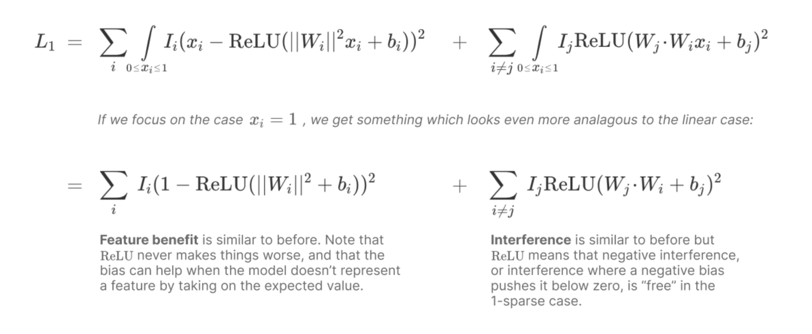

This new equation is vaguely similar to the famous Thomson problem in chemistry. In particular, if we assume uniform importance and that there are a fixed number of features with $\|W_i\| = 1$ and the rest have $\|W_i\| = 0$, and that $b_i = 0$, then the feature benefit term is constant and the interference term becomes a generalized Thomson problem – we're just packing points on the surface of the sphere with a slightly unusual energy function. (We'll see this can be a productive analogy when we resume our empirical investigation in the following sections!)

Another interesting property is that **ReLU makes negative interference free in the 1-sparse case**. This explains why the solutions we've seen prefer to only have negative interference when possible. Further, using a negative bias can convert small positive interferences into essentially being negative interferences.

## Superposition in a Privileged Basis

Goal: to explore the simplest toy model which gives us a privileged basis

2 ways to make the model have a privileged basis:

1. **Add an activation function.**
2. Apply L1 regularization to the hidden layer.

***Focus on adding an activation function***
$$
h = ReLU(Wx)
$$

$$
x' = ReLU(W^Th + b)
$$

Adding a ReLU to the hidden layer radically changes the model from an interpretability perspective. **The key thing is that while $W$ in our previous model was challenging to interpret (recall that we visualized $W^TW$ rather than $W$**), $W$ in the ReLU hidden layer model can be directly interpreted, since it connects features to basis-aligned neurons.


#### VISUALIZING SUPERPOSITION IN TERMS OF NEURONS

Visualize its weights as a stack of rectangles on top of each other:

+ Each column in the stack plot visualizes one **column of $W$.** 
+ Each rectangle represents one weight entry, with height corresponding to the absolute value. 
+ **The color of each rectangle corresponds to the feature it acts on** (i.e., which row of $W$ it's in). 
+ **Negative values go below the x-axis.** 
+ **The order of the rectangles is not significant.**

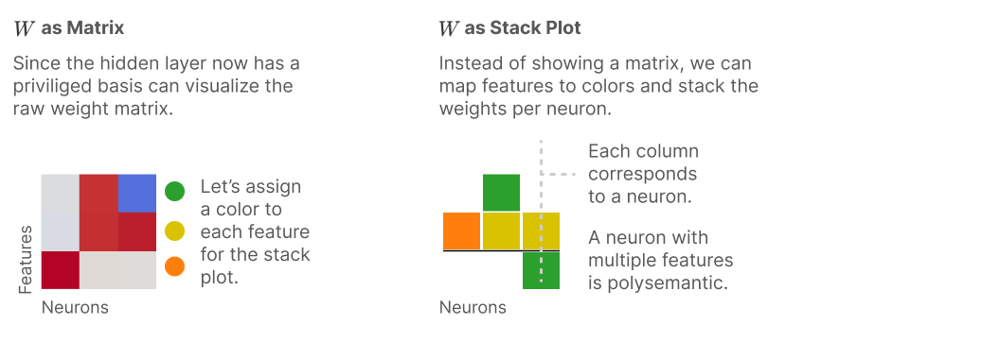

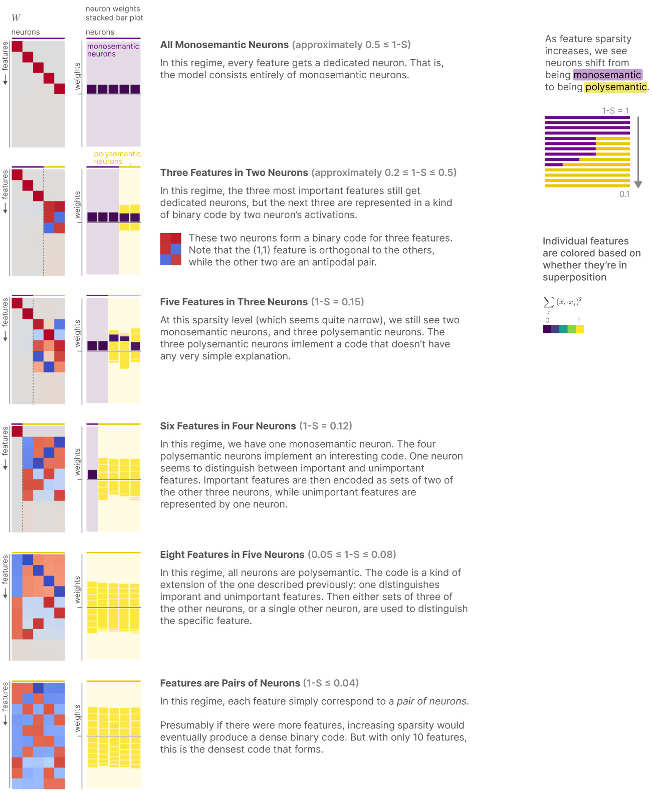

 **There's a shift from monosemantic to polysemantic neurons as sparsity increases**.

## [Computation in Superposition](https://transformer-circuits.pub/2022/toy_model/index.html#computation)

we think that neural networks can ***perform computation entirely in superposition*** rather than ***just using it as storage.*** 

A new setup where we imagine **our input and output layer to be the layers of our hypothetical disentangled mode**l, but **have our hidden layer be a smaller layer** we're imagining to be the observed model **which might use superposition**. 

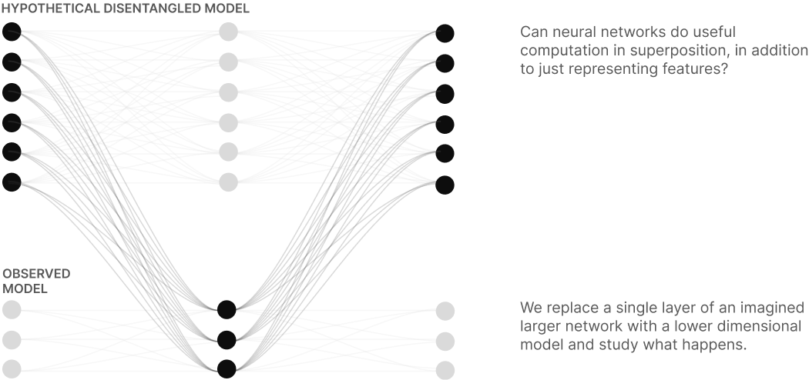

We'll have the model compute $y = \text{abs}(x)$. 

Absolute value is an appealing function to study because there's a very simple way to compute it with ReLU neurons: 
$$
\text{abs}(x) = \text{ReLU}(x) + \text{ReLU}(-x).
$$

Since this model *needs* ReLU to compute absolute value, it doesn't have the issues the model in the previous section had with trying to avoid the activation function.

### [Experiment Setup](https://transformer-circuits.pub/2022/toy_model/index.html#computation-setup)

The input feature vector, $x$, **is still sparse**, with **each feature $x_i$ having probability $S_i$ of being $0$.** However, since we want to have the model compute the absolute value, we need to allow it to take on non-positive values for this to be a non-trivial task. As a result, if it is non-zero, its value is now **sampled uniformly from $[-1, 1]$**. The target output $y$ is $y = \text{abs}(x)$.

Following the previous section, we'll consider the "ReLU hidden layer" toy model variant, but **no longer tie the two weights to be identical:**

- $h = \text{ReLU}(W_1 x)$
- $y' = \text{ReLU}(W_2 h + b)$

The loss is still the mean squared error weighted by feature importances $I_i$ as before.

### [Basic Results](https://transformer-circuits.pub/2022/toy_model/index.html#computation-basic)

Having a hidden layer activation function means that it makes sense to visualize the weights in terms of neurons. We can visualize $W$ directly or as a neuron stack plot as we did before. We can also visualize it as a graph, which can sometimes be helpful for understanding computation.

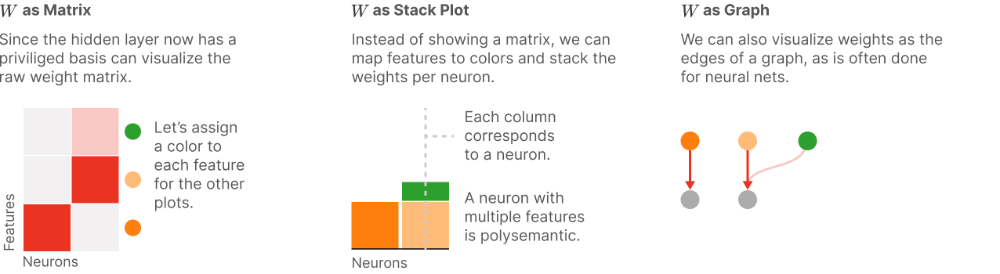

What happens when we train a model **with $n=3$ features** to perform absolute value on **$m=6$ hidden layer neurons**?


### [Superposition vs Sparsity](https://transformer-circuits.pub/2022/toy_model/index.html#computation-super-v-sparsity)

Train models with **$n=100$ features** and **$m=40$ neurons**, and a feature importance curve $I_i = 0.8$ for each $i$, varying feature sparsity.


Much like we saw in the ReLU hidden layer models, these results demonstrate that activation functions, under the right circumstances, create a privileged basis and cause features to align with basis dimensions. In the dense regime, we end up with each neuron representing a single feature, and we can read feature values directly off of neuron activations.

However, once the features become sufficiently sparse, this model, too, uses superposition to represent more features than it has neurons. This result is notable because it demonstrates the ability of neural networks to **perform computation** even on data that is represented in superposition.

### [The Asymmetric Superposition Motif](https://transformer-circuits.pub/2022/toy_model/index.html#computation-asymmetric-motif)


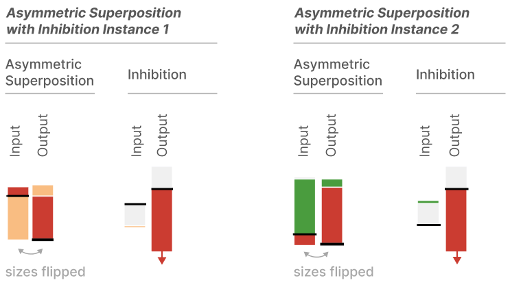

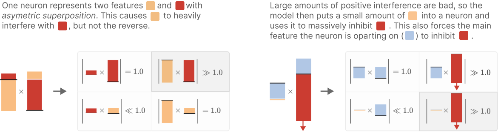
