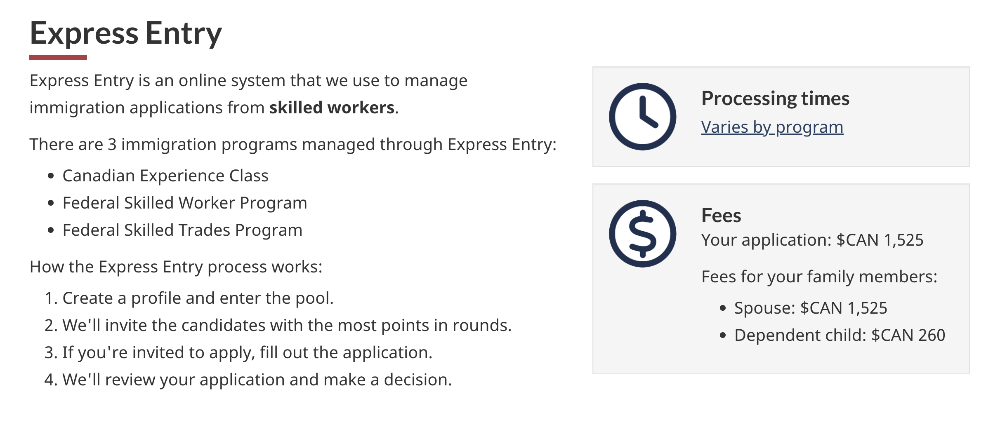
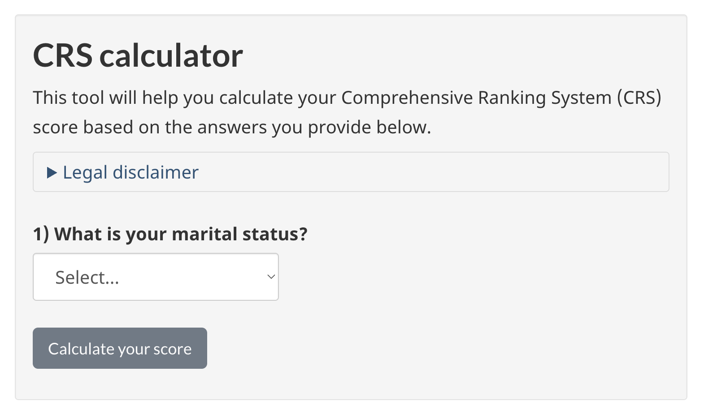
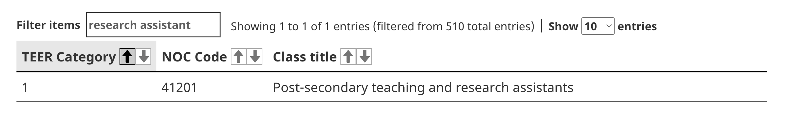
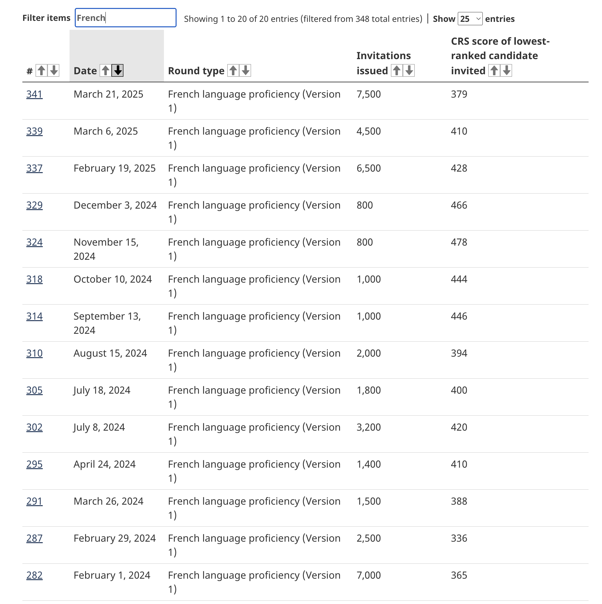

---
categories:
  - French
  - EE Entry
date: 
  created: 2025-06-01
draft: false
links:
  - index.md
readtime: 30
slug: ee-french-zh
authors:
  - <qihang>
---

# 如何通过学习法语和快速通道 (Express Entry) 申请加拿大永久居留权（PR）

本博客将介绍如何借助加拿大快速通道系统（Express Entry），通过法语能力类别（French-language proficiency）来申请加拿大永久居民（permanent residence，简称 PR）。我们将首先概览 Express Entry 的整体结构，随后重点解读 **加拿大经验类（Canadian Experience Class）** 以及 **法语能力类别（French-language proficiency）** 的申请资格。

**TL;DR：**

1. 首先确认你是否符合 [Express Entry 的基本申请条件](#star-eligibility-for-immigration-programs)。  
2. [计算你的 CRS 分数](#comprehensive-ranking-system-crs)，并参考 [法语能力类别近期的邀请分数线](#star-information-of-french-language-proficiency-category-in-recent-round)。  
3. 如果分数具备竞争力，就可以开始准备法语考试，力争满足 [该类别的最低语言要求](#star-french-language-proficiency-category-eligibility)。  
<!-- more -->

## 概览
[TOC]

## 什么是 Express Entry？

[Express Entry](https://www.canada.ca/en/immigration-refugees-citizenship/services/immigrate-canada/express-entry) 是加拿大移民局（IRCC）为管理技术移民而设立的在线申请系统。本文将其简称为 `EE Entry`。

EE Entry 基于评分系统运作，包含多个移民项目（immigration programs）和特定类别（selection categories）。理解这两大结构，是最大化你的综合排名系统（Comprehensive Ranking System，简称 CRS）得分的关键。在接下来的内容中，我们将聚焦于加拿大经验类（Canadian Experience Class）和法语能力类别（French-language proficiency）。详细信息可参考 [EE Eligibility](https://www.canada.ca/en/immigration-refugees-citizenship/services/immigrate-canada/express-entry/who-can-apply.html#programs)。

{width=90% style="display: block; margin: 0 auto; text-align: center;"}

EE Entry 主要由以下三大部分组成：

1. **综合排名系统（CRS）**：用于评估和对候选人进行打分排名；
2. **移民项目（Immigration Programs）**：决定你是否能进入 EE 候选池；
3. **当前类别（Current Categories）**：为特定群体提供额外加分或定向邀请。

## 综合排名系统（CRS）

综合排名系统（Comprehensive Ranking System，CRS）是 EE Entry 的核心。它根据个人的教育背景、语言能力、工作经验等维度进行评分，并用于候选池排序。

你可以使用 [IRCC 提供的官方 CRS 评分计算器](https://www.canada.ca/en/immigration-refugees-citizenship/services/immigrate-canada/express-entry/check-score.html#calculator) 来预估自己的得分情况。

**一般来说，年轻、学历高的申请人，通过法语类别拿到足够 CRS 分数的机会较大。**

{width=60% style="display: block; margin: 0 auto; text-align: center;"}

## EE Entry 下的三类移民项目（Immigration Programs）

### 可选项目包括：

1. 加拿大经验类（Canadian Experience Class）  
2. 联邦技术工人项目（Federal Skilled Worker Program）  
3. 联邦技工类项目（Federal Skilled Trades Program）  

### 🚀 $\star$ 加拿大经验类（CEC）申请条件：

1. 工作需属于国家职业分类（NOC）系统中的 TEER 0、1、2 或 3 类别；  
2. 工作经验必须在加拿大境内获得，并持有合法的临时居民身份；  
3. 工作内容需基本符合所申报职业的职责描述；  
4. 需为有偿工作（领取工资或佣金）；  
5. 累计经验需满一年（或1560小时），且为申请前三年内获得。  

#### 如何查询你的 NOC 与 TEER 等级？

1. 使用 [Find your NOC 工具](https://www.canada.ca/en/immigration-refugees-citizenship/services/immigrate-canada/find-national-occupation-code.html) 搜索你的职位；  
2. 前往 [NOC 官方网站](https://noc.esdc.gc.ca/?GoCTemplateCulture=en-CA) 核对工作职责是否匹配；  
3. 若该职业归类在 TEER 0–3 范围，即可符合 CEC 申请条件。  

📌 示例：如果你是加拿大高校的教学助理（TA）或研究助理（RA），对应的 NOC 代码为 `41201`，属于 TEER 1。若你累积了一年全职（或等效兼职）经验，即可符合加拿大经验类项目的要求。

{width=90% style="display: block; margin: 0 auto; text-align: center;"}

## 当前类别（Current Categories）

满足基本项目要求后，你还可以通过以下定向类别（Current Categories）提升竞争力：

1. 法语能力类别（French-language proficiency）  
2. 医疗与社会服务职业  
3. STEM（科学、技术、工程与数学）职业  
4. 技工类职业  
5. 农业与农产品类职业  
6. 教育类职业  

### 🚀 $\star$ 法语能力类别的申请要求：

1. 满足 Express Entry 系统基本要求（即符合三大移民项目之一）；  
2. 法语语言测试（如 TCF Canada）四项能力均达到 NCLC（Niveaux de compétence linguistique canadiens）7 级；  
3. 满足当轮邀请的所有特定要求。  

#### 法语考试 TCF Canada 与 NCLC 对应表（节选）：

| NCLC 等级 | 口语 | 听力 | 阅读 | 写作 |
|-----------|------|------|------|------|
| 7         | 10-11 | 458-502 | 453-498 | 10-11 |

📖 完整表格请见 [语言成绩与 NCLC 等级换算参考](https://www.canada.ca/en/immigration-refugees-citizenship/services/study-canada/work/after-graduation/eligibility/language-results.html)

### 🚀 $\star$ 法语类别邀请流程

当 IRCC 举办定向轮次时，将按照以下流程操作：

1. 筛选候选池中符合法语类别条件的申请人；  
2. 按 CRS 分数排名，向得分靠前者发出永久居留邀请（Invitation to Apply, ITA）。

详情见：[IRCC 定向类别说明页面](https://www.canada.ca/en/immigration-refugees-citizenship/services/immigrate-canada/express-entry/rounds-invitations/category-based-selection.html)

### 🚀 $\star$ 近期数据参考：2024 年法语类别邀请情况

根据 [IRCC 官方数据](https://www.canada.ca/en/immigration-refugees-citizenship/corporate/mandate/policies-operational-instructions-agreements/ministerial-instructions/express-entry-rounds.html)，2024 年法语能力类别共邀请 23,500 人，CRS 分数区间为 **336 - 478**。

{width=80% style="display: block; margin: 0 auto; text-align: center;"}

## 总结

**近年来，法语能力类别一直保持稳定的邀请节奏。如果你符合该类别并拥有不错的 CRS 分数，被邀请的机会非常可观。**

## 参考资料

- [Express Entry 主页面](https://www.canada.ca/en/immigration-refugees-citizenship/services/immigrate-canada/express-entry)  
- [三大移民项目资格说明](https://www.canada.ca/en/immigration-refugees-citizenship/services/immigrate-canada/express-entry/who-can-apply.html#programs)  
- [CRS 计算器](https://www.canada.ca/en/immigration-refugees-citizenship/services/immigrate-canada/express-entry/check-score.html#calculator)  
- [加拿大经验类说明（CEC）](https://www.canada.ca/en/immigration-refugees-citizenship/services/immigrate-canada/express-entry/who-can-apply/canadian-experience-class.html)  
- [定向类别说明页](https://www.canada.ca/en/immigration-refugees-citizenship/services/immigrate-canada/express-entry/rounds-invitations/category-based-selection.html)  
- [邀请轮次历史数据](https://www.canada.ca/en/immigration-refugees-citizenship/corporate/mandate/policies-operational-instructions-agreements/ministerial-instructions/express-entry-rounds.html)  
- [查找你的 NOC 工具](https://www.canada.ca/en/immigration-refugees-citizenship/services/immigrate-canada/find-national-occupation-code.html)  
- [NOC 官方数据库](https://noc.esdc.gc.ca/?GoCTemplateCulture=en-CA)  
- [NOC 代码 41201 详情页](https://noc.esdc.gc.ca/Structure/NOCProfile?code=41201&version=2021.0)